# Automação de Testes com Selenium WebDriver

[← Voltar](https://github.com/joycequoos/Test_QA/blob/main/README.md)

Manual resumido com as principais informações do curso de Automação de Testes com Selenium WebDriver, utilizando Java, Maven e JUnit.

## Sobre o Selenium WebDriver

O Selenium WebDriver é uma das ferramentas mais utilizadas no mercado para automação de testes de interfaces web. Ele permite controlar um navegador programaticamente — clicando em elementos, preenchendo formulários, navegando entre páginas e validando comportamentos — simulando as ações que um usuário real realizaria.

- **Multiplataforma** — suporta os principais navegadores (Chrome, Firefox, Edge, Safari) e pode ser usado em diferentes sistemas operacionais.
- **Multilinguagem** — possui bindings para diversas linguagens de programação, como Java, Python, C# e JavaScript.
- **Integração com frameworks de teste** — funciona em conjunto com frameworks como JUnit e TestNG, permitindo estruturar suítes de teste organizadas, com asserts e relatórios de execução.
- **Ampla adoção no mercado** — é uma das ferramentas mais utilizadas em times de QA e automação de testes, com grande comunidade e documentação disponível.

Este manual guia a configuração do ambiente e os primeiros passos para criar um teste automatizado do zero, usando Java com Selenium WebDriver.

## Passo a Passo da Configuração do Ambiente

### 1. Instalar o JDK (Java Development Kit)

Para automatizar os testes utilizando o Selenium WebDriver com Java, é necessário instalar na máquina uma JDK (Java Development Kit), responsável por estruturar e compilar o código dos testes.

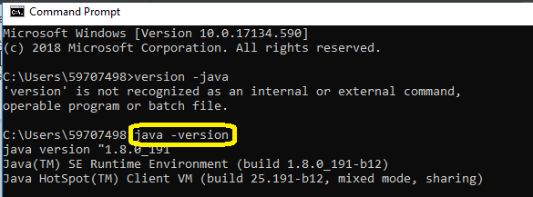

### 2. Baixar e Instalar a IDE (IntelliJ IDEA)

Após instalar o JDK, baixe e instale a IDE que será utilizada para escrever o código — neste manual, o IntelliJ IDEA.

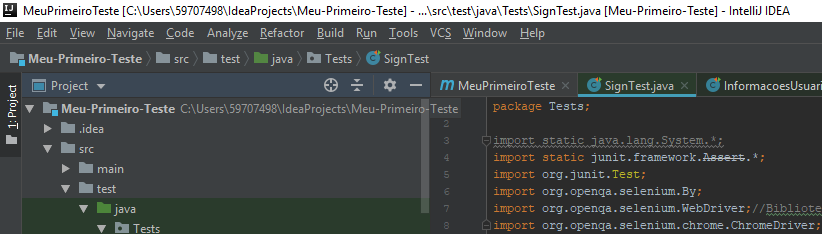

### 3. Criar um Projeto Maven

Após a instalação da IDE, crie um projeto do tipo **Maven**. O Maven gerencia as dependências do projeto de forma mais prática, evitando a necessidade de baixar e configurar bibliotecas manualmente.

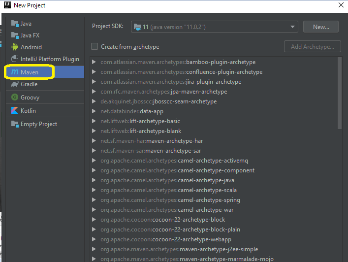

### 4. Adicionar as Dependências (JUnit e Selenium WebDriver)

No arquivo `pom.xml` do projeto Maven, adicione as dependências do **JUnit** (framework de testes) e do **Selenium WebDriver** (ferramenta de automação).

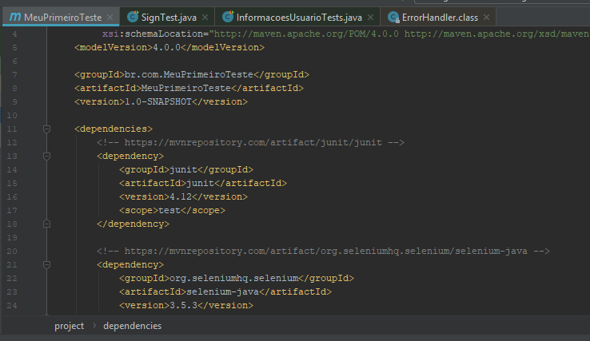

### 5. Baixar o ChromeDriver

Baixe o **ChromeDriver**, o executável que permite ao Selenium controlar o navegador Google Chrome. É importante utilizar a versão compatível com a versão do Chrome instalada na máquina.

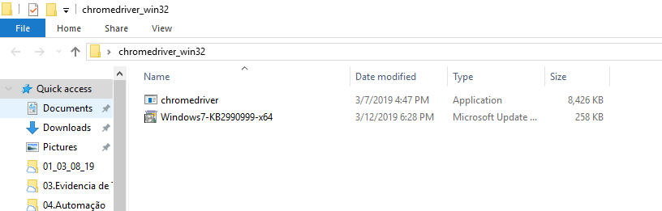

### 6. Criar o Package e a Classe de Testes

Crie um package chamado `Tests` e, dentro dele, uma classe Java que vai concentrar o código do teste automatizado.

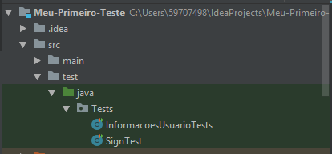

### 7. Importar as Bibliotecas do JUnit e do Selenium WebDriver

Na classe criada, importe as bibliotecas necessárias do JUnit e do Selenium WebDriver para poder utilizá-las no código.

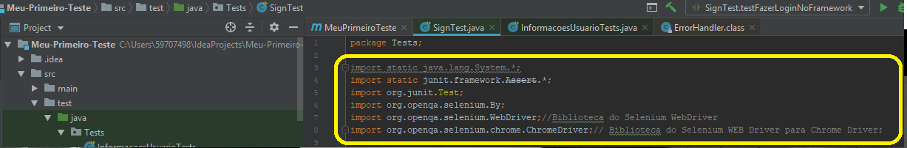

### 8. Abrir o Navegador e Acessar a URL

Inclua o comando para abrir o navegador Chrome e adicionar a URL da página que será testada.

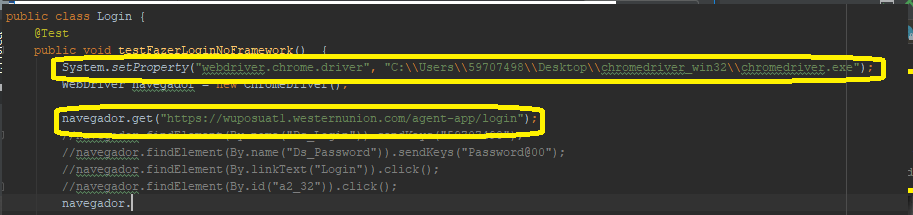

## Identificando Elementos na Página

### 1. Inspecionar Elementos da Página

Com a página aberta, clique com o botão direito e selecione **Inspect Element**. Na opção **Doc Side**, selecione **Dock to bottom** para facilitar a visualização do código junto à página.

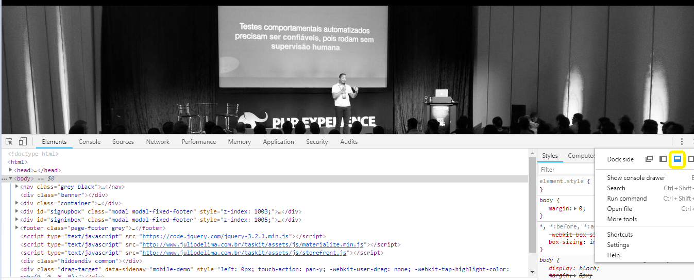

### 2. Selecionar o Elemento Desejado

Ao selecionar os códigos da página, os elementos correspondentes são destacados. No exemplo abaixo, ao selecionar o código referente ao botão "Sign In", o item aparece marcado na tela.

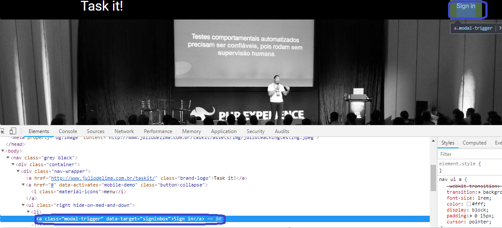

### 3. Escolher o Melhor Localizador (Locator)

Ao identificar um elemento, é importante escolher a melhor forma de localizá-lo no código:

- **Primeira verificação: possui `ID`?** Se sim, é melhor utilizar o ID, pois a probabilidade de se repetir na página é pequena.
- **Segunda verificação: possui `Name`?** É a segunda melhor opção, porém o atributo `name` pode se repetir com mais frequência que o ID.

## Principais Comandos para Manipular Elementos

A tabela abaixo resume os principais comandos utilizados para localizar e interagir com elementos da tela na programação com Selenium WebDriver.

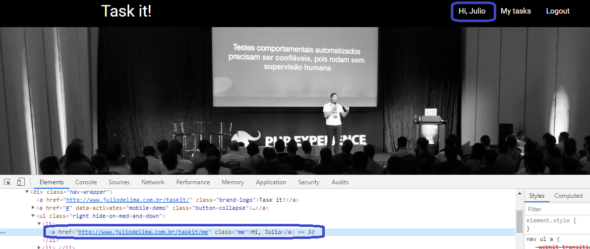

Para o elemento de exemplo:

```html
<a href="http://www.juliodelima.com.br/taskit/me" class="me">Hi, Julio</a>
```

Alguns exemplos de como localizar e interagir com esse elemento:

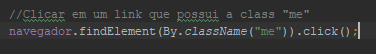

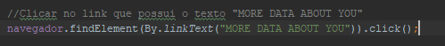

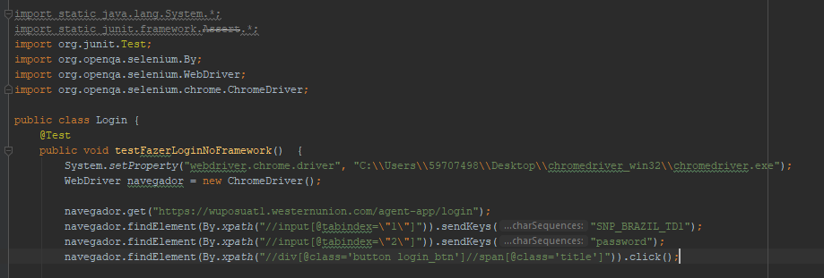

## Considerações Finais

Este manual cobre o essencial para configurar o ambiente e criar o primeiro teste automatizado com Selenium WebDriver: da instalação do JDK e da IDE até a identificação de elementos e a escrita dos primeiros comandos de interação com a página. A partir daqui, os próximos passos naturais incluem o uso de esperas explícitas (`WebDriverWait`), a organização dos testes em Page Objects e a geração de relatórios de execução.
